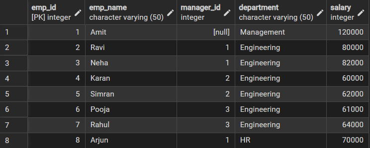
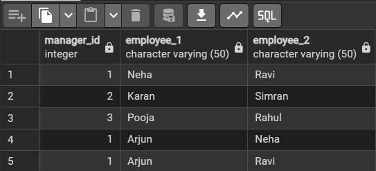
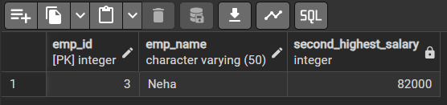

# 25MCI10122_PRIYANKA_25MAM_KAR-1_DBMS

## Code Structure

```sql
CREATE TABLE Employees (
    emp_id INT PRIMARY KEY,
    emp_name VARCHAR(50),
    manager_id INT,
    department VARCHAR(50),
    salary INT
);

INSERT INTO Employees VALUES
(1, 'Amit', NULL, 'Management', 120000),
(2, 'Ravi', 1, 'Engineering', 80000),
(3, 'Neha', 1, 'Engineering', 82000),
(4, 'Karan', 2, 'Engineering', 60000),
(5, 'Simran', 2, 'Engineering', 62000),
(6, 'Pooja', 3, 'Engineering', 61000),
(7, 'Rahul', 3, 'Engineering', 64000),
(8, 'Arjun', 1, 'HR', 70000);
```

### Table Output

<p align="center">

</p>

---

# Q1: Find Employees Working Under the Same Manager

```sql
select emp1.manager_id,emp1.emp_name as employee_1,emp2.emp_name as employee_2 
from employees as emp1
join employees as emp2
on emp1.manager_id = emp2.manager_id 
and emp1.emp_name < emp2.emp_name;
```

### Output

<p align="center">

</p>

---

# Q2: Find Employee with Second Highest Salary

```sql
SELECT emp_id, emp_name, salary
FROM Employees
WHERE salary < (SELECT MAX(salary) FROM Employees)
ORDER BY salary DESC
LIMIT 1;
```

### Output

<p align="center">

</p>

---
